# Lab Report 2 - Failure-Inducing Inputs and Symptoms
### Written by: Tracy Zhao (A16764072)

---

## Code Change 1 

>I. Link to test-file1.md

[test-file1.md](https://github.com/pandasrcute/markdown-parser/blob/233a87aa2d5a656f85466e7d19e6a68d6fa3a536/test-file1.md)

>II. Screenshot of test-file1.md code

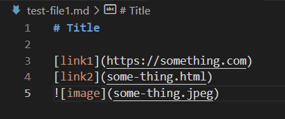

>III. Screenshot of failure inducing output of test-file1.md

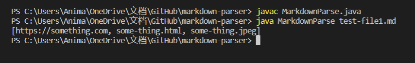

>IV. Screenshot of failure-inducing output of test-file1.md in the commit message

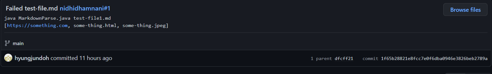

>V. Screenshot of code change of MarkdownParse.java

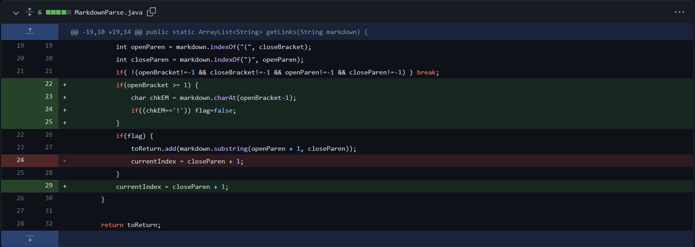

>VI. Screenshot of the fixed output for test-file1.md

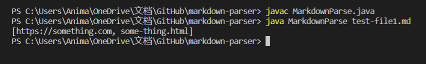

>VII. Relationship between bug, symptom, and failure-inducing input

Using an image syntax as the failure-inducing input caused a symptom in the program, which is the incorrect output of the image as a link. The bug that caused this is a logical error since the code didn't include any conditions that determined whether it was in the form of image. To fix this, a condition was set to check if the character right before the open bracket was an exclamation mark `!`. 

---

## Code Change 2

>I. Link to test-file2.md

[test-file2.md](https://github.com/pandasrcute/markdown-parser/blob/233a87aa2d5a656f85466e7d19e6a68d6fa3a536/test-file2.md)

>II. Screenshot of test-file2.md code

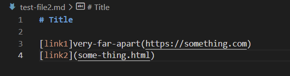

>III. Screenshot of failure inducing output of test-file2.md

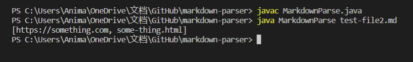

>IV. Screenshot of failure-inducing output of test-file2.md in the commit message

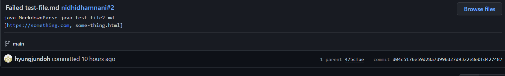

>V. Screenshot of code change of MarkdownParse.java

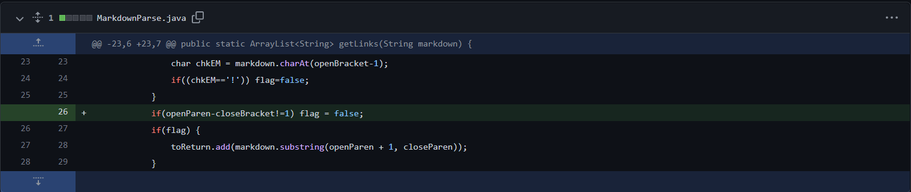

>VI. Screenshot of the fixed output for test-file2.md

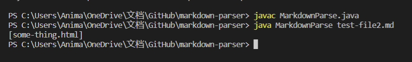

>VII. Relationship between bug, symptom, and failure-inducing input

Using `[]` and `()` but very far apart in the file as failure-inducing input caused a symptom in the program, which is the incorrect output of the string inside `()` in line 3. This is incorrect because the syntax of a link is `[link](link)`, where `(` is directly after `]`. To fix this bug that caused the symptom, a condition was set to check if the character directly after `]` is `(`, and if it isn't, the string inside `()` will not be added to the ArrayList `toReturn`.

---

## Code Change 3 

>I. Link to test-file3.md

[test-file3.md](https://github.com/pandasrcute/markdown-parser/blob/233a87aa2d5a656f85466e7d19e6a68d6fa3a536/test-file3.md)

>II. Screenshot of test-file3.md code

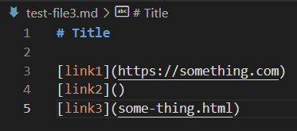

>III. Screenshot of failure inducing output of test-file3.md

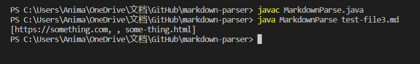

>IV. Screenshot of failure-inducing output of test-file3.md in the commit message

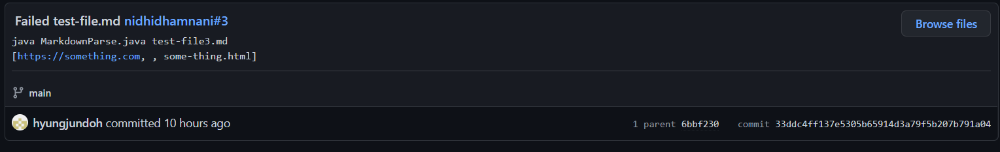

>V. Screenshot of code change of MarkdownParse.java

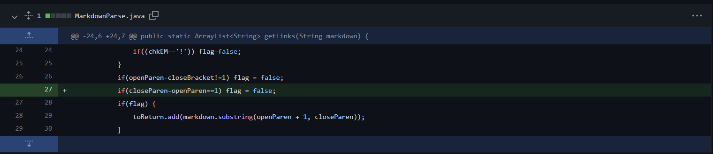

>VI. Screenshot of the fixed output for test-file3.md

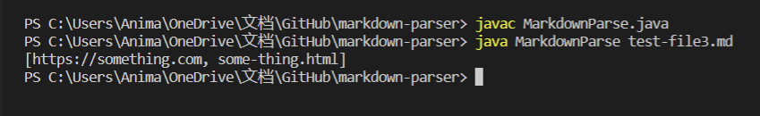

>VII. Relationship between bug, symptom, and failure-inducing input

Using a file that has no link inside the `()` as seen in line 4 of test-file3.md caused a symptom in the program, which is the incorrect output of the null value inside `()`. Since there is no link inside `()`, it shouldn't be added to the ArrayList `toReturn`. To fix this bug that caused the symptom, a condition was set to check if the character directly after `(` is `)`, and if it is, it means that there is no link in `()`, and it will not be added to the ArrayList `toReturn`.