# Lab Report 3 
### Written by: Tracy Zhao (A16764072)

---

## Streamlining ssh Configuration
-> Every time we log into our ieng6 account, we have to type `ssh cs15lsp22zzz@ieng6.ucsd.edu`, and that is hard to remember. It is also very long to type especially if we have to log out and back in multiple times in one sitting. That's why ssh has configuration files that can save us from typing this long command.

`.ssh/config` file  
This file tells SSH what username to use when logging into specific servers, and even give servers nicknames. I edited it using VScode.  

Now that we have set this up, all we have to do is type `ssh ieng6` to log in. 
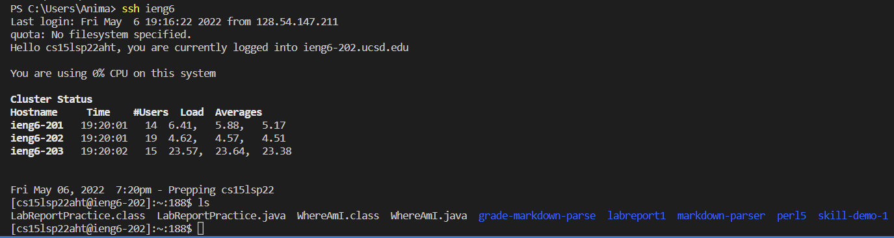

Here is an `scp ` command copying a file into my account
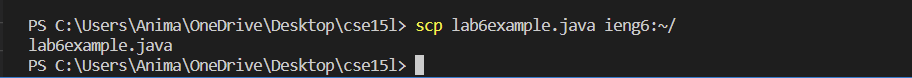

---

## Setup Github Access from ieng6
-> If you try to use `commit` and `push` this from the command line, you’ll likely see an error. You must use a token-based login mechanism like SSH keys. To fix this, you need to add the public key you made to Github.  

This is my public key that I made from the remote access lab. (on Github)
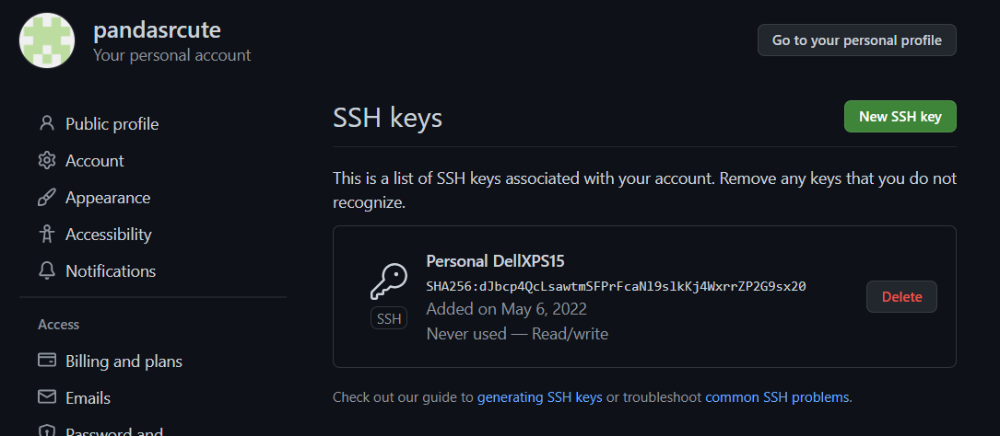 

Here are the public key and private key (in my user account).
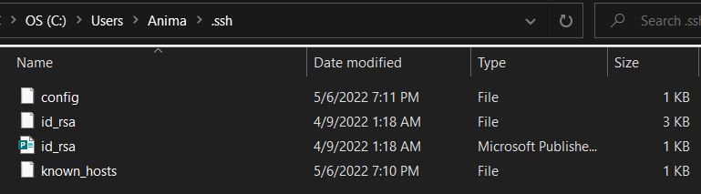

Now using `git` commands to commit and push a change to Github while logged into my ieng6 account.
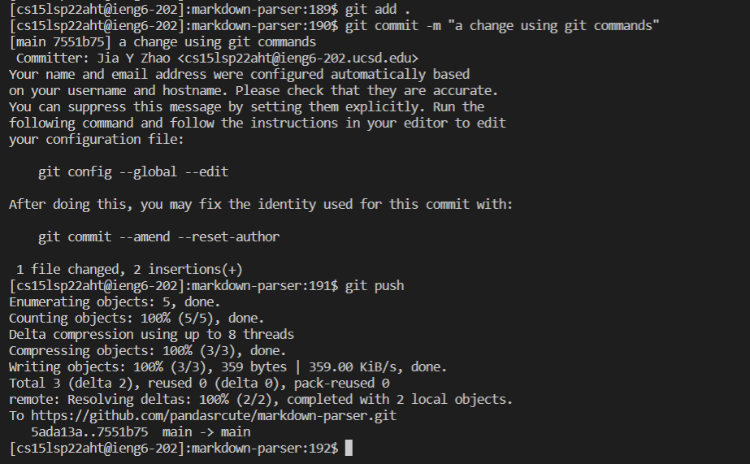

Here is the [link](https://github.com/pandasrcute/markdown-parser/commit/7551b75dd2169169129584d8c3185a4d928e3767) resulting commit:
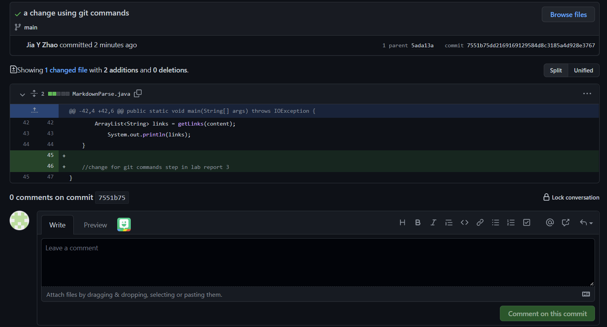

---

## Copy whole directories with `scp -r`
-> The command `scp -r` allows us to copy entire directories by recursively copying the directory and all the files and directories within it, and all the files and directories with those, and so on.

Copying my whole markdown-parse directory to my ieng6 account (very long)
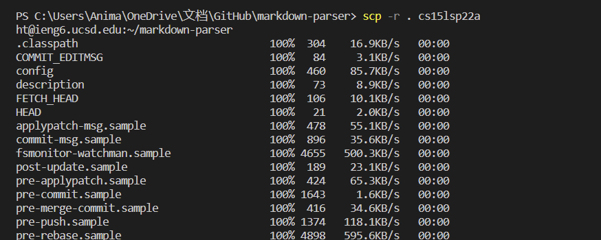
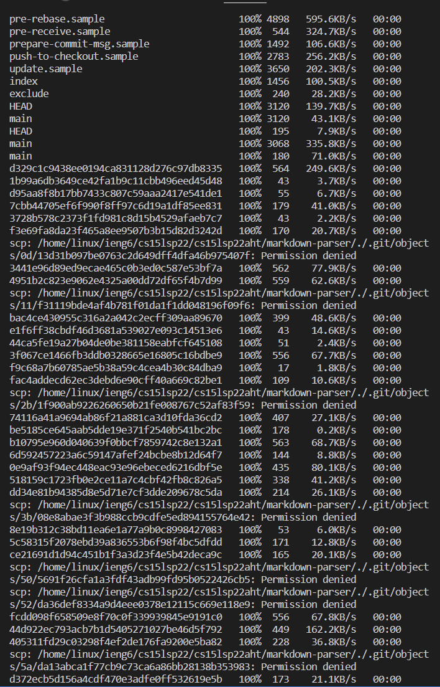
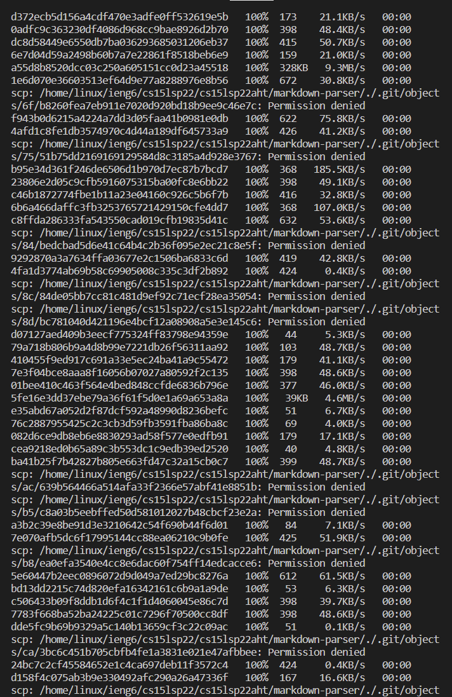

Copying all the .java and .md files as well as lib from my markdown-parser directory to my ieng6 account. (shortened)
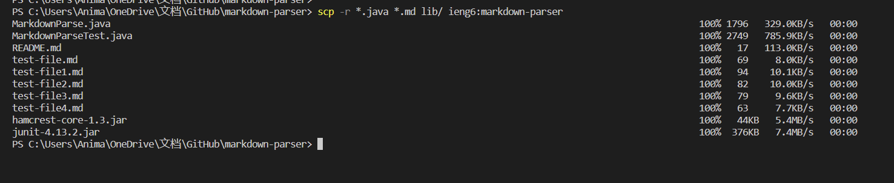

Logging into my ieng6 account and compiling and running tests for my repository.
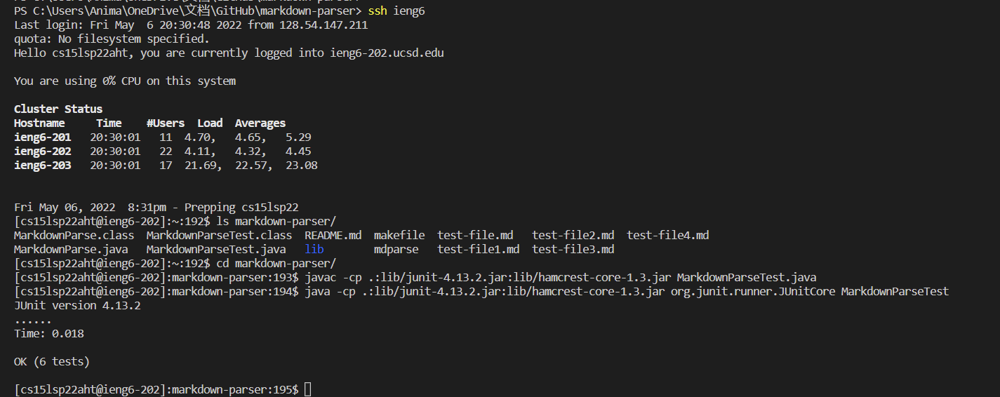

Combining `scp`, `;`, and `ssh` to copy the whole directory and run the tests in one line.
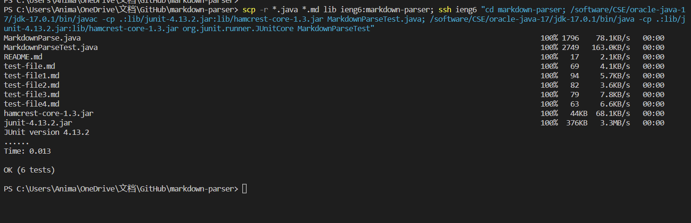
