# Lab Report 4 
### Written by: Tracy Zhao (A16764072)

---

## Links to markdown-parser repositories
[My markdown-parser](https://github.com/pandasrcute/markdown-parser)<br>
[Reviewed markdown-parser](https://github.com/ima-quack/markdown-parser)

---

## Expected Outputs (using VScode preview)
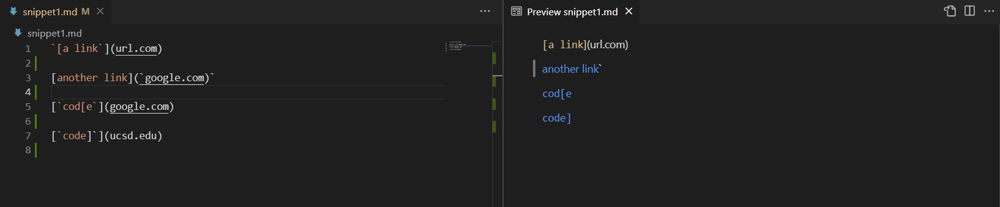

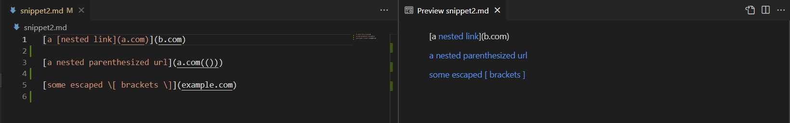

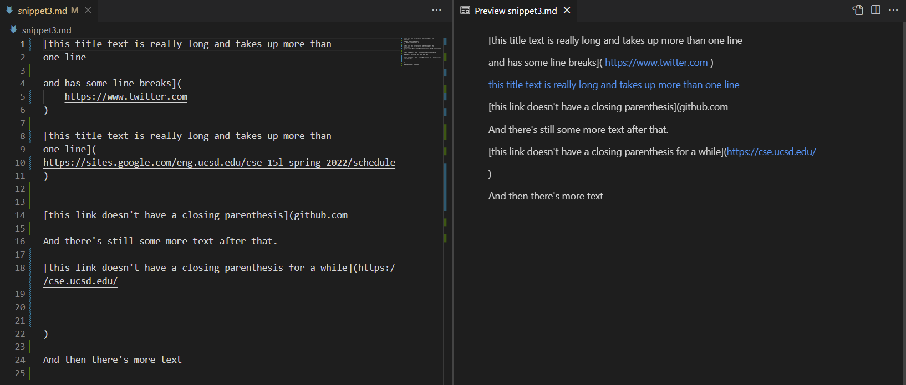

---

## Code for tests in `MarkdownParseTest.java`


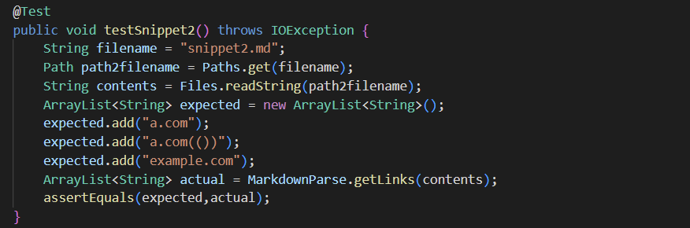


---

## Output from running the tests

My Implementation:

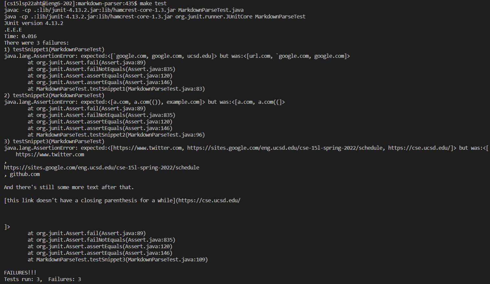

Reviewed Implementation:

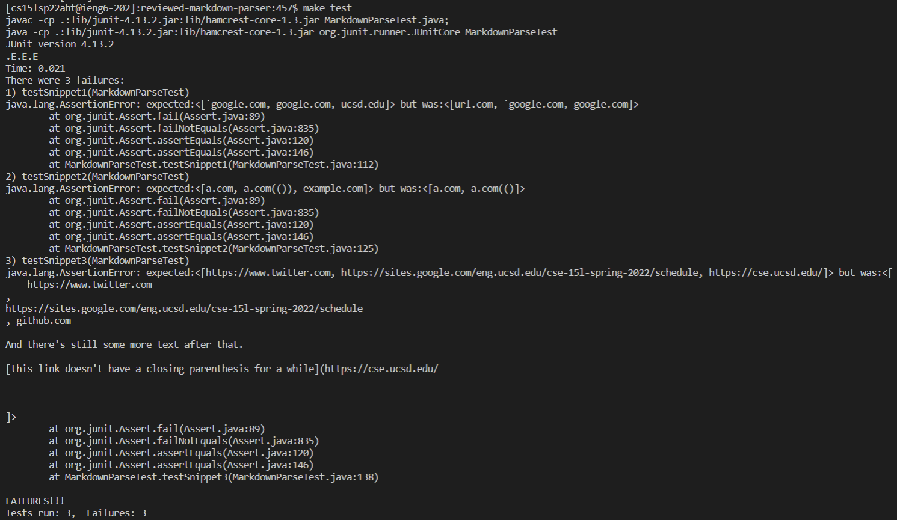

Note: I used the command `make test` to run the JUnit tests

---

## My Implementation

Snippet 1: failed 

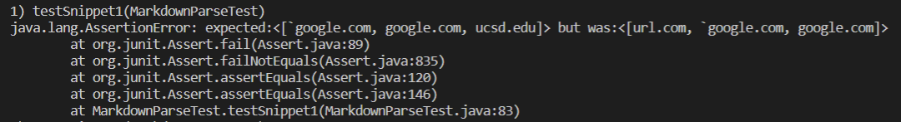

Snippet 2: failed 

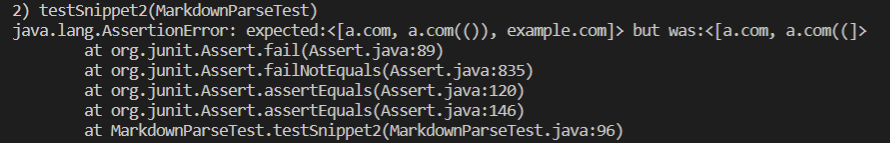

Snippet 3: failed 

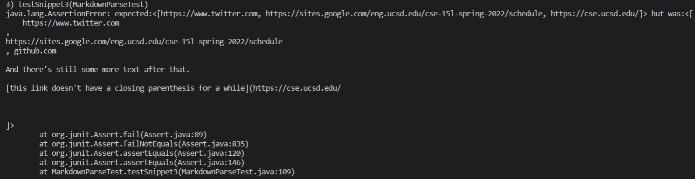

---

## Reviewed Implementation

Snippet 1: failed 

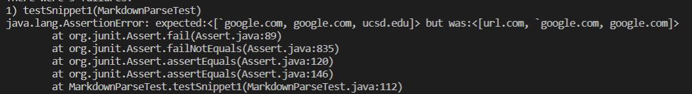

Snippet 2: failed 

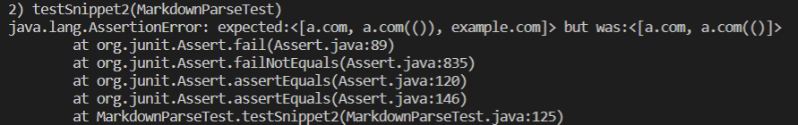

Snippet 3: failed 

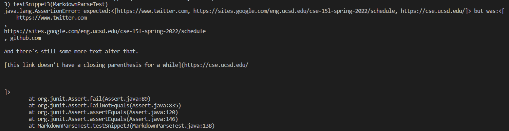

--- 

## Questions
* Do you think there is a small (<10 lines) code change that will make your program work for snippet 1 and all related cases that use inline code with backticks? If yes, describe the code change. If not, describe why it would be a more involved change.<br>
**Answer:** I think that there is a small code change that will make my program work. The following lines of code (original code is included) check if there exists a second `]` that is right before `(` and check if there is a backtick before `[`, and it worked. However, a function can be written to check all the related cases with backticks that may require more than 10 lines of code. <br>

```
//added this line
int secondcloseBracket = markdown.indexOf("]", closeBracket+1);

//added this if-statement
if (secondcloseBracket == openParen - 1){
    closeBracket = secondcloseBracket;
} 

if( !(openBracket!=-1 && closeBracket!=-1 && openParen!=-1 && closeParen!=-1) ) break;
if(openBracket >= 1) {
   char chkEM = markdown.charAt(openBracket-1);
   if((chkEM=='!')) flag=false;
   //added this line
   if((chkEM=='`')) flag=false;
   }
```

* Do you think there is a small (<10 lines) code change that will make your program work for snippet 2 and all related cases that nest parentheses, brackets, and escaped brackets? If yes, describe the code change. If not, describe why it would be a more involved change.<br>
**Answer:**  A solution that I came up with was to write while loops to check that as long as the character after `)` is `)`, then it will add 1 to the `closeParen`. I did the same for the `]`. However, this solution may not work for all related cases so more lines of code would be needed.<br>

```
while(markdown.charAt(closeParen+1) == ')'){
   closeParen++;
}
while(markdown.charAt(closeBracket+1) == ']'){
   closeBracket++;
}
```

* Do you think there is a small (<10 lines) code change that will make your program work for snippet 3 and all related cases that have newlines in brackets and parentheses? If yes, describe the code change. If not, describe why it would be a more involved change.<br>
**Answer:**  I believe that the program would need a more involved-change since there are so many related cases to check for. Examples would be to check for spaces in between `(` and `)` and ignore them since markdown only reads the actual link and check for valid links because it shouldn't be several lines as in the failed output provided. 
