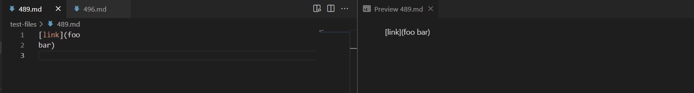
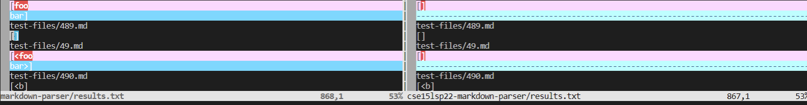
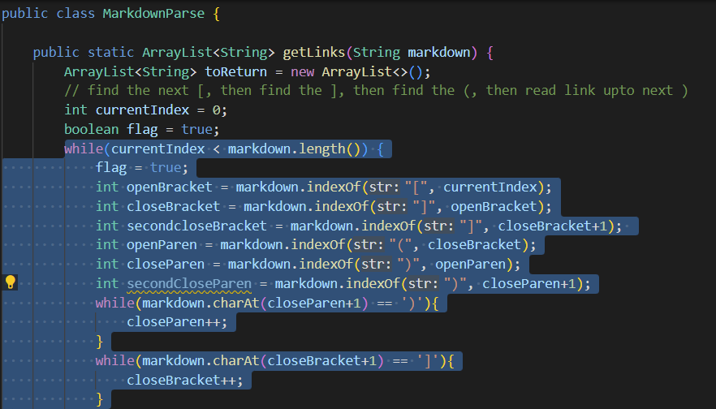
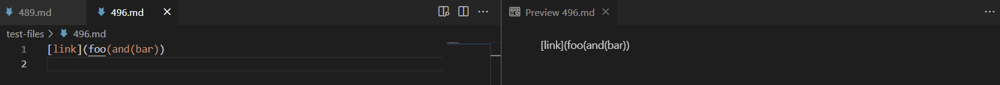
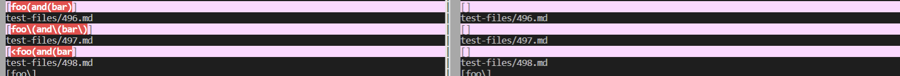
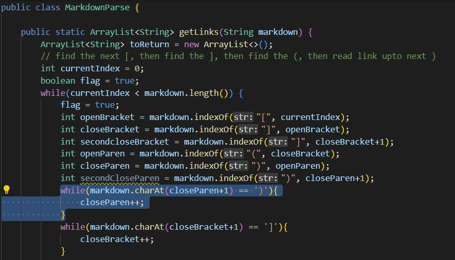

# Lab Report 5 
### Written by: Tracy Zhao (A16764072)

---

## General Overview:
In this lab report, I will choose 2 tests from the 652 tests where my implementation had different answers than the implementation provided for lab 9. I used `vimdiff` with the two result files from the two implementations to see the differences. 
 **Note**: I used the command `bash script.sh > results.txt` on both of the implementations to output the results to a text file.

---

## Test 1 `489.md`:
[Link to 489.md](https://github.com/pandasrcute/markdown-parser/blob/a195c9219c29d78add47ef9fb5371ca9f3708b7d/test-files/489.md) 

**Expected Output (using VSCode Preview):** `[]`

**Actual Output:**

Left - my implementation ; Right - provided implementation

The correct implementation is the provided implementation since it did return `[]`, an empty list with no links.

The bug in my implementation is that it doesn't check whether or not part of the link is split into two lines. In this case, the code should detect if there is a line break and see if part of the link is on a different line somewhere within the while loop as highlighted in the image below. 

---

## Test 2 `496.md`:
[Link to 496.md](https://github.com/pandasrcute/markdown-parser/blob/main/test-files/496.md) 

**Expected Output (using VSCode Preview):** `[]`

**Actual Output:**

Left - my implementation ; Right - provided implementation

The correct implementation is the provided implementation since it did return `[]`, an empty list with no links.

The bug in my implementation is that it doesn't check if every open bracket or parenthesis has a corresponding close bracket or parenthesis. In this case, the code change should be within this while loop (highlighted below) to check if the amount of close parentheses match the amount of open parentheses because there's three (3) `(` but only two (2) `)`. 

