# Lab Report 1 - Remote Access 
### Written by: Tracy Zhao (A16764072)

---

## STEP 1 - Installing VS Code <br>
The installation of VScode is fairly easy and simple. 

1) Go to the Visual Studio Code website by clicking on this [link](https://code.visualstudio.com/) [Note: there are versions available for common operating systems such as Windows and macOS.] <br>

2) After installing and accepting the agreement, you should be able to see a window like the following. [Note: you may have different colors depending on your system and settings]<br>
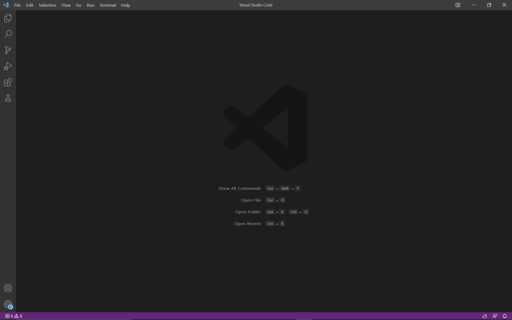

---

## STEP 2 - Remotely Connecting
Now that you have successfully installed VS Code, you will now move on to connecting to a remote computer over the Internet from your very own device. 

If you're on Windows, install a program called OpenSSH. This will allow you to connect your computer to other computers that have this. There are two ways in which you can do this: Windows settings or PowerShell. In this report, I will show you using the first option.

1) Using Windows Settings (Windows Server 2019 and Windows 10 devices)
* Open **Settings**, select **Apps > Apps & Features**, then select **Optional Features**. 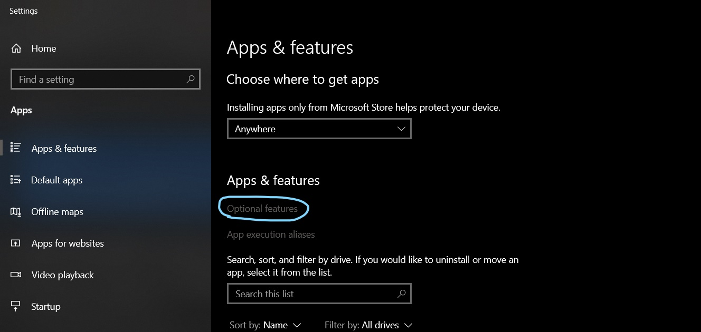
* Check to see if OpenSSH is already installed. If not, select the option **Add a feature** then find and install the following:<br>
  -> OpenSSH Client <br>
  -> OpenSSH Server 

* Once this is done, return to **Apps > Apps & Features > Optional Features** and OpenSSH should be listed. 
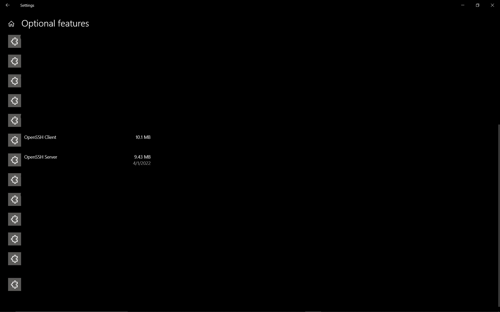

2) After this, look up your course-specific account for CSE15L by clicking this [link](https://sdacs.ucsd.edu/~icc/index.php). Once you're there, just enter your username and PID, and you should be able to see all the course-specific accounts associated with your student account.

3) We now will connect to the remote computer using Visual Studio Code's remote option. 
* Open a terminal in VSCode (can be done in 2 ways) <br>
  -> Ctrl + ` <br>
  -> On the top menu panel, click **Terminal > New Terminal**

4) Type in the command below and replace `zz` with the letters in your course-specific account (for clarification, it's "one(1), five(5), l")<br>
`$ ssh cs15lsp22zz@ieng6.ucsd.edu`


5) If this is the first time you've connected to this server, a message like this may pop up.
```
ssh cs15lsp22zz@ieng6.ucsd.edu

The authenticity of host 'ieng6.ucsd.edu (128.54.70.227)' can't
be established.

RSA key fingerprint is
SHA256:ksruYwhnYH+sySHnHAtLUHngrPEyZTDl/1x99wUQcec.

Are you sure you want to continue connecting (yes/no/[fingerprint])?
```

6) Agree to this message by typing in `yes`. You should be prompted to enter your password. Your screen should look similar to this once you have successfully connected to a computer in the CSE basement. <br>
```
ssh cs15lsp22aht@ieng6.ucsd.edu
Password:
Last login: Fri Apr  1 11:33:28 2022 from 128.54.184.112
quota: No filesystem specified.
Hello cs15lsp22aht, you are currently logged into ieng6-203.ucsd.edu

You are using 0% CPU on this system

Cluster Status
Hostname     Time    #Users  Load  Averages
ieng6-201   14:15:01   3   0.00,  0.04,  0.11
ieng6-202   14:15:01   10  4.08,  4.11,  4.17
ieng6-203   14:15:01   5   1.23,  1.24,  1.21


Fri Apr 01, 2022  2:18pm - Prepping cs15lsp22
[cs15lsp22aht@ieng6-203]:~:2$
```

---

## STEP 3 - Trying Some Commands
Let's try running some commands on both your computer and on the remote computer after ssh-ing. 

1) On your computer
* Let's run the following commands:
  -> `cd` - change directory
  -> `ls` - list files
  -> `pwd` - print working directory
  -> `mkdir` - make directory
  -> `cp` - copy 
  -> `cat` - view or create a file
  -> `cd ~` - return to home directory

Here's an example 
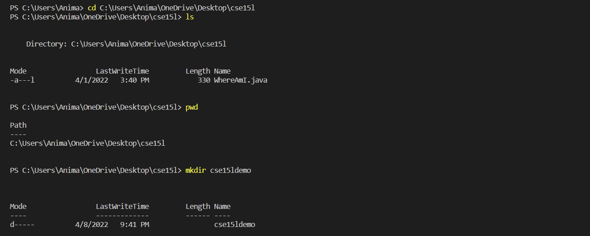
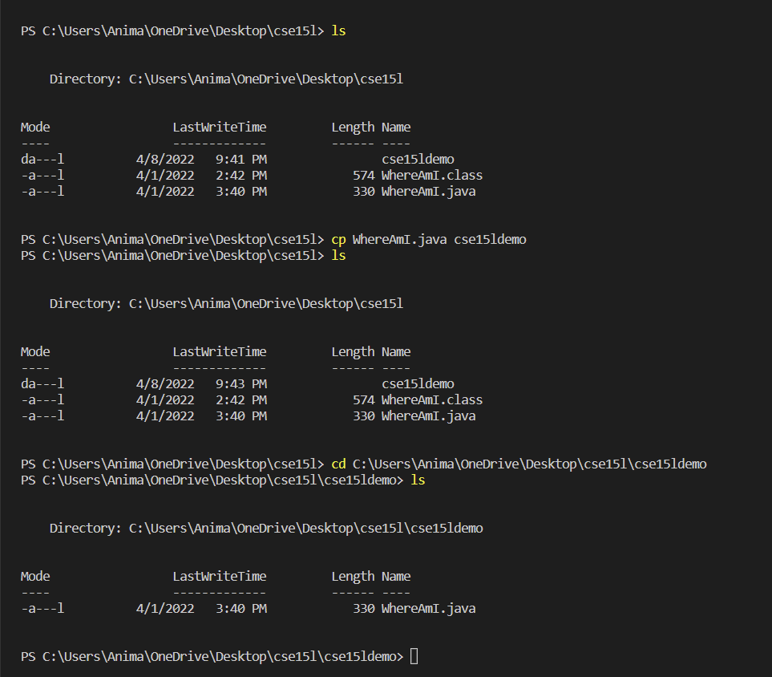
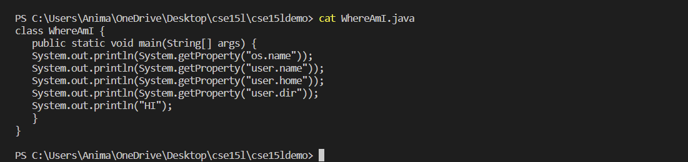

2) On the remote computer
* Let's try running some of the commands that we used earlier after ssh-ing. 
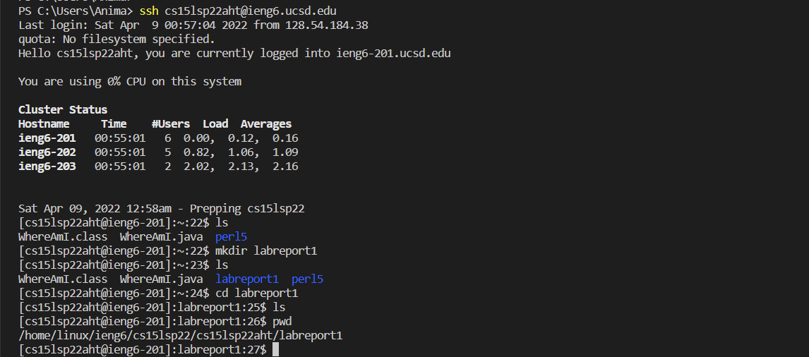
* To log out of the remote server in your terminal, use `Ctrl-D`.

---

## STEP 4 - Moving Files with `scp`
The command `scp` allows you to copy a file(s) from your computer to a remote computer. You will always run it from the client (your computer, not the remote computer). <br>

1) Let's create a file on your computer and name it `LabReportPractice.java`. Then copy the following contents into it.
```
class LabReportPractice {
   public static void main(String[] args) {
      System.out.println(System.getProperty("os.name"));
      System.out.println(System.getProperty("user.name"));
      System.out.println(System.getProperty("user.home"));
      System.out.println(System.getProperty("user.dir"));
   }
}
```

2) Run it using the commands `javac` and `java` on your computer.<br>
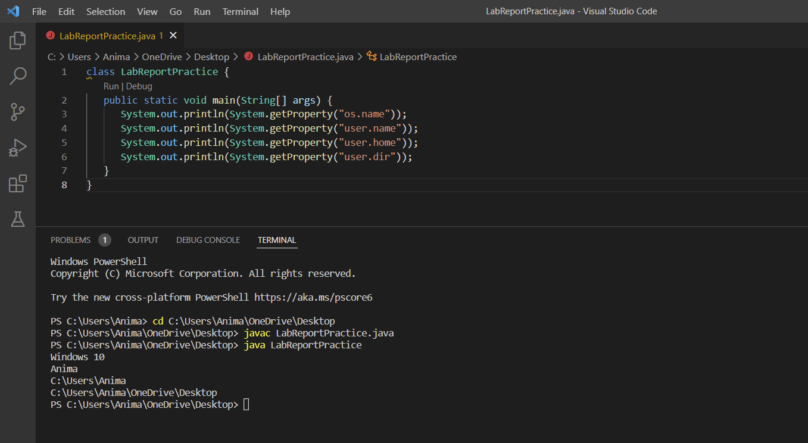

3) In the terminal from the directory where you created this file, run the following command. (don't forget to change it to your username)<br>
`scp LabReportPractice.java cs15lsp22zz@ieng6.ucsd.edu:~/`

4) Enter your password just like how you would when you log in with ssh. 

5) To verify if it was copied over successfully, log in with ssh again and use the command `ls`. You should be able to see it in your home directory.

6) Run the file using the commands `javac` and `java`. Java is installed on the server, so you should be able to run it. <br>


---

## STEP 5 - Setting an SSH Key
I'm sure you have noticed by now that every time we use the commands `ssh` or `scp`, we had to type or copy-paste our password. Sometimes, it may get frustrating when it doesn't work, and it can be very time consuming. Luckily, there's a way to avoid this problem, and that is `ssh` keys. 

Using a program called `ssh-keygen`, it creates a pair of files called the public key and private key. The public key will be copies to a location on the server and the private key will be in a location on the client. Instead of using your password, the `ssh` command will use the pair of files.  

1) On your computer, run the following commands (make sure to enter your username **instead of** `<user-name>`)
```
$ ssh-keygen

Generating public/private rsa key pair.

Enter file in which to save the key
(/Users/<user-name>/.ssh/id_rsa): /Users/<user-name>/.ssh/id_rsa

Enter passphrase (empty for no passphrase):
```

**Note: Do not enter a paraphrase** <br>

```
Enter same passphrase again:

Your identification has been saved in
/Users/<user-name>/.ssh/id_rsa.

Your public key has been saved in
/Users/<user-name>/.ssh/id_rsa.pub.

The key fingerprint is:
SHA256:jZaZH6fI8E2I1D35hnvGeBePQ4ELOf2Ge+G0XknoXp0 <user-name>@<system>.local

The key's randomart image is:
+---[RSA 3072]----+
| |
| . . + . |
| . . B o . |
| . . B * +.. |
| o S = *.B. |
| = = O.*.*+|
| + * *.BE+|
| +.+.o |
| .. |
+----[SHA256]-----
```
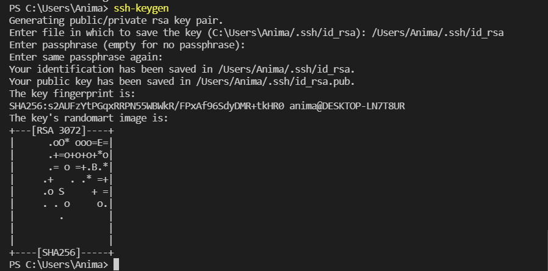

2) If you're on Windows, follow the extra ssh-add steps by clicking this [link](https://docs.microsoft.com/en-us/windows-server/administration/openssh/openssh_keymanagement#user-key-generation).

3) Let's copy the public key to the `.ssh` directory of your user account on the server.
```
$ ssh cs15lsp22zz@ieng6.ucsd.edu
<Enter Password>
# now on server
$ mkdir .ssh
$ <logout>

# back on client
$ scp /Users/<user-name>/.ssh/id_rsa.pub
cs15lsp22zz@ieng6.ucsd.edu:~/.ssh/authorized_keys
```
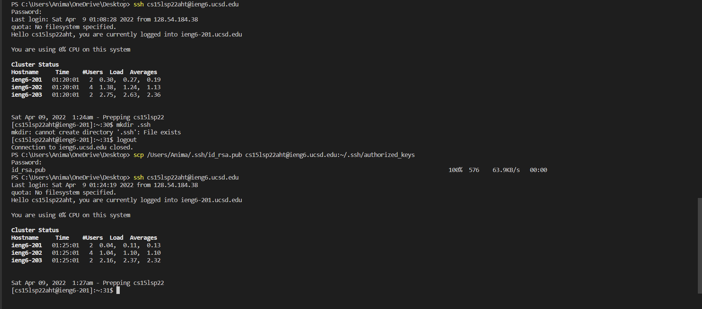

---

## STEP 6 - Optimizing Remote Running
You can actually make remote running faster and more pleasant by using the following tips: <br>
1) Directly running a command on the remote server by putting it in quotes after the `ssh` command.
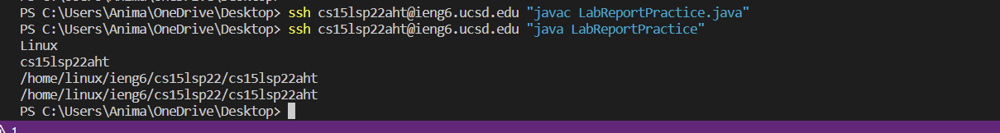

2) Running multiple commands on the same line in most terminals by separating the commands with a ";".


3) Instead of typing a command again, you can use the up-arrow button on your keyboard to recall the previous command.


 


